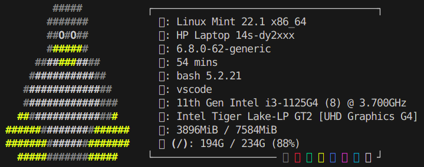
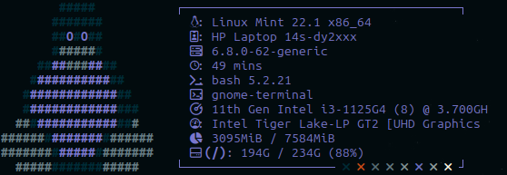

# 🖥️ Neofetch Config

my personal custom `neofetch` configuration for a clean, visually balanced system info display.

Optimized for minimal setups and tiling WMs. Uses compact ASCII art with clean spacing, relevant metrics, and icon-enhanced sections.

## Preview

